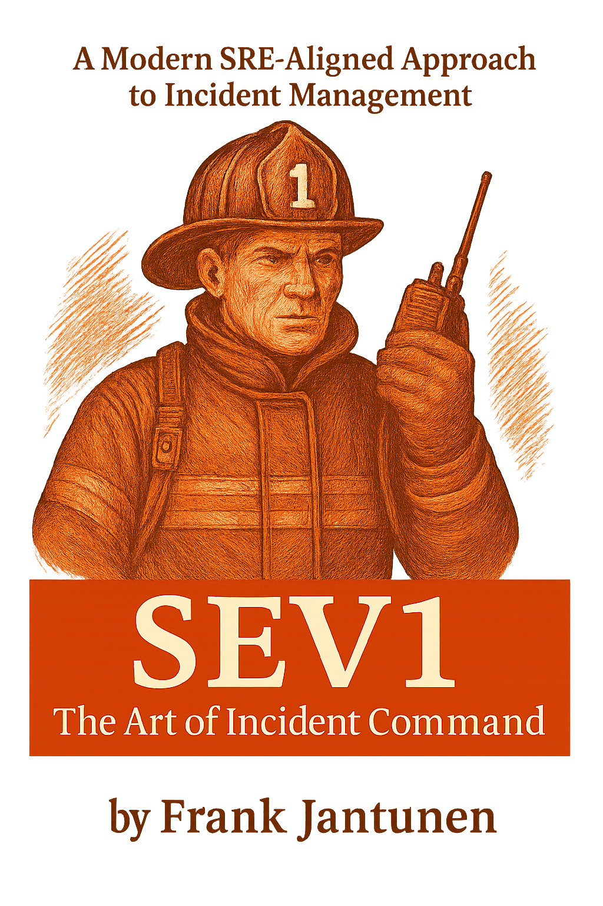

<link href="https://fonts.googleapis.com/css2?family=Roboto+Slab:wght@400;700&display=swap" rel="stylesheet">
<link rel="stylesheet" href="assets/css/style.css">
# SEV1 - The Art of Incident Command

## A Modern SRE-Aligned Approach to Incident Management
By Frank Jantunen

### Copyright Page

Copyright © 2025 Frank Jantunen
All rights reserved.

This work is distributed under a value-for-value model. It may be freely read, shared, and discussed for personal, non-commercial use. If you found it valuable, consider supporting the project or sharing it. 🙏

For commercial use—including redistribution, employee training, or internal documentation—please contact the author directly at frank.jantunen@gmail.com.

No part of this publication may be reproduced, stored in a retrieval system, or transmitted by any means—electronic, mechanical, photocopying, recording, or otherwise—for commercial use without prior written permission from the author.

Printed in USA 🇺🇸
First Edition – June 2025

### Legal Disclaimer ⚖️

This book is intended for informational and educational purposes only. The views expressed are those of the author and do not represent the positions of any employer, organization, or entity unless explicitly stated.

All trademarks, logos, and brand names mentioned are the property of their respective owners. Their use is for identification and illustrative purposes only and does not imply affiliation, sponsorship, or endorsement.

Mentions of specific services, platforms, or vendors—including but not limited to PagerDuty, Datadog, Honeycomb, Gremlin, Netflix, Google, PayPal, and Microsoft—are made for example and context. No payments, sponsorships, or kickbacks were received. This book promotes no specific tool or service. All references are used in a neutral, educational context.

The content is provided “as-is.” Readers assume full responsibility for the use of any information presented herein. Always evaluate ideas in the context of your organization’s specific needs and risks.

### Table of Contents 📜

Acknowledgements
Foreword

**Part I: Before the Incident 🕰️**

1.  What Is an Incident, Really? 🤔
2.  Operational Mindset & Culture 🧠
3.  Clear Criteria for Incident Declaration ✅
4.  Systems, Playbooks & Observability 🗺️
5.  Alerting Without the Noise 🔕
6.  Training, Simulation & Team Maturity 🏋️‍♀️

**Part II: During the Incident 🔥**

7.  Triggers & Assembly 🚦
8.  Incident Command in Practice 🧑‍✈️
9.  Communication Under Pressure 🗣️
10. Managing People, Pace & Burnout 🧘

**Part III: After the Incident 📝**

11. Declaring the End & Recovery 🏁
12. Postmortems That Don’t Suck ✨
13. From Lessons to Systems Change 🔄
14. Measuring What Matters 📊
15. The Future State of Incident Command 🔮

Conclusion

The Journey Continues: Further Learning and Resources 🚀

### Acknowledgements 🙏

To my family, who never asked why I was obsessed with writing this book—just made sure I didn’t forget to eat. Thank you for the support! ❤️

To Eric, who’s been a great mentor and a constant source of inspiration.

To everyone I’ve worked with over the years. 🤝

To my employers—for helping me grow my career and helping me feed my family.

To the Learning From Incidents community, and to those who’ve pushed reliability thinking beyond dashboards and into the human domain—your work paved the way for this one.

Thank you to everyone who’s ever written a clear postmortem, spoken up when something felt off, or challenged process for the sake of people. You’ve made this field more humane, and this book wouldn’t exist without your example.

And to anyone who reads this and offers value for value—thank you. That exchange means more than you know. ✨

### Foreword

When I got into tech in June 2000—slapping together fugly websites, streaming low-res videos, and trying to keep NT4 servers running—before YouTube was even a concept, I was live streaming, running end-to-end event production and becoming the SME for anything streaming or CDN. 👨‍💻

By 2011, I’d stumbled into incident management. The industry was deep in its ITIL hangover—rigid process, thick hierarchies, and enough red tape to mummify a data center. 📜 It brought order, sure, but agility? Like trying to steer a cargo ship with a joystick. 🚢

Then came the SRE wave. 🌊 Suddenly everyone wanted to “do SRE,” flipping the script on how we think about reliability and response. But despite all the tooling, the frameworks, the culture decks—we’re still flailing when it comes to human factors.

I’ve ridden every wave since—sometimes surfing 🏄‍♂️, sometimes just staying afloat. In 2018, working at a startup, I got my first exposure into the role of incident commander. No training, no playbook, barely any system visibility. Just raw chaos, flaming chainsaws 🔥🪚, and the expectation to “own it.” That trial by fire taught me this: strong incident command is non-negotiable, especially when you’re also wearing three other hats. 🎩🎩🎩

Across startups and giants, I’ve watched teams fumble and stall—not because they lacked tools, but because they ignored culture. Fixing incident management means wrestling that beast. And let’s not kid ourselves—it’s like sprinting uphill through molasses.

**SEV1 – The Art of Incident Command** is the distilled chaos. Not sanitized “best practices,” but the book I wish someone had handed me when I was drowning. It’s built from scars, scraped from real-world incidents, and shaped by teams both scrappy and sprawling.

Today, incident response is a three-ring circus: engineers juggling pagers 📟, debugging blind 🕶️, and improvising in real time while the stakes climb and the tooling sprawls. This book is your survival guide and your last line of defense.

🌊 The water’s rough. Are you ready to jump in?

—Frank Jantunen

## PART I: Before the Incident 🕰️

### 1. What Is an Incident, Really? 🤔

#### The ITIL View: A Starting Point

The ITIL (Information Technology Infrastructure Library) framework provides a classic definition of an incident:

> "An unplanned interruption to an IT service or reduction in the quality of an IT service."

This approach is service-focused, reactive, and operational by nature—an incident exists when someone or something detects a problem.

#### Where ITIL Falls Short: The Priority Matrix Trap 😬

In modern, complex systems, the traditional ITIL model's handling of urgency and impact is a critical bottleneck. The model separates priority from severity, calculating priority based on a function of its two main inputs:

Priority = Impact x Urgency

A typical ITIL-centric matrix illustrates this friction:

| Impact ↓ / Urgency → | Low (Can be planned) | Medium (Disrupts some users) | High (Widespread disruption) | Critical (Business viability risk) |
| :------------------- | :------------------- | :--------------------------- | :--------------------------- | :--------------------------------- |
| **High (Major outage)** | P2 | P1 | P1 | P1 |
| **Medium (Feature fail)** | P3 | P2 | P1 | |
| **Low (Minor issue)** | P4 | P3 | P2 | |

> ⏳ **Debating whether an incident is a P2 or P3 wastes time not spent mitigating escalating customer impact.**

#### The SRE Mindset: Engineering for Failure 💡

Site Reliability Engineering (SRE) collapses the distinction between priority and severity to move faster and assumes system failures are inevitable.

Key shifts:

* **Incidents are learning signals** 🎓, not just problems to fix.
* **Teams can declare incidents based on suspicion, not proof.**
* **Early detection creates valuable time to prevent or reduce customer impact.**

#### Where an Incident Begins

A modern guideline:

> **An incident begins when a responder believes action may be needed to preserve service reliability.**

One person is all it takes to declare:
"Something may be wrong. We should respond as if it is until we confirm otherwise."

Example triggers:

* Threshold alerts (metrics exceed limits) 📈
* Composite alerts (multiple signals) ➕
* Log-based alerts (error patterns) 📄
* Failed synthetic checks 🤖
* Breached SLOs 💔
* Human reports 🙋‍♀️
* External indicators (status pages, social media) 🐦

#### Example Modern Severity Matrix 🚀

| Severity | Impact | Typical Response Time | Examples & Notes |
| :------- | :----- | :-------------------- | :--------------- |
| **SEV-0 (optional)** | Severe platform failure, business risk | Immediate | Catastrophic event, exec-level coordination, unknown recovery path |
| **SEV-1** | Major service degradation or outage | < 3 min | Core features down, large-scale impact, "all-hands" response |
| **SEV-2** | Moderate service impact | < 5 min | Significant performance issues, workaround may exist, multiple services affected |
| **SEV-3** | Degraded user experience | < 15 min | Minor bug, single-service impact, logged for resolution |
| **SEV-4 (optional)** | Minimal/cosmetic impact | < 48 hours | Flexible, for deferred issues |
| **SEV-5 (optional)** | External/Partner issues | Monitor Only | Third-party outage, visible but not actionable |

> 📊 **Reality Check:** Most teams operate with just SEV-1 to SEV-3. Start simple, expand only if needed.

#### Lifecycle Comparison

| Framework | Lifecycle Steps | Primary Context |
| :-------- | :-------------- | :-------------- |
| **ITIL** | Detection → Logging → Categorization → Prioritization → Diagnosis → Resolution → Closure | Operational helpdesk 📞 |
| **SRE** | Detect → Triage → Mitigate → Resolve → Review | Fast-moving, distributed systems 💨 |
| **NIST** | Preparation → Detection & Analysis → Containment, Eradication & Recovery → Post-Incident Activity | Security-focused response 🛡️ |

> 🔑 **Key Takeaway:**
> Effective incident management requires knowing which framework to apply and when to adapt. SRE principles thrive on clarity and speed, collapsing the old severity/priority math into a single, actionable SEV level.
>
> 🔑 **Keep it simple:** map severity to priority directly and define levels by the response they demand.

### 2. Operational Mindset & Culture 🧠

Incidents do not happen in a vacuum. Team response, escalation, and recovery are shaped by culture—how a team thinks, behaves, and values its work.

#### Resilience Over Redundancy

Redundancy can mask fragility. Instead of fixing flaky systems, teams add layers.

**Resilience** means being honest about what breaks, why, and what to do when it breaks again.

It’s about graceful degradation, fast recovery, and human readiness.

Resilient teams:

* Stay calm under pressure 😌
* Shift strategies when needed 🔄
* Fix contributing factors, avoid tunnel vision 🎯

Resilient systems:

* Use circuit breakers 🛑
* Deploy feature flags 🚩
* Rely on multi-region failover 🌍
* Implement load shedding ⚖️
* Add synthetic checks 🧪

#### Blamelessness and Psychological Safety ❤️

If engineers are afraid to speak up, incident response is compromised.

**Blame kills curiosity. 🔪**

Blameless culture separates the person from the process, focusing on why a decision made sense at the time.

Psychological safety means:

* People can admit uncertainty 🤔
* Call out confusion without fear 🗣️
* Escalate when things felt wrong 🚨

#### SRE vs. DevOps Culture: Bridging the Mindsets

| SREs | DevOps |
| :--- | :----- |
| Emphasize error budgets, reliability as feature | Fast, iterative, delivery-focused |
| Treat ops as software problem | Willing to trade stability for speed |
| Quantify risk, push back on unsustainable pace | Adaptable, but risk burnout or inconsistent quality |

Bridge-building strategies:

* Shared retrospectives 🤝
* Cross-functional drills 🏋️
* Role flipping 🔄
* Translation layer 🗣️

#### 🏗️ Building Resilient Systems: Two Pillars

**System-Level Resilience**

* 🔄 Circuit breakers & retries
* ⚖️ Load balancing & failover
* 📈 Monitoring, logging, tracing
* 🚨 Structured on-call process
* 🔥 Regular fire drills
* 🛠️ Reliable incident tooling

**Adaptive Capacity (Resilience Engineering)**

* 🔬 Study work-as-actually-done
* 📚 Learn from successes & near-misses
* 🛡️ Foster psychological safety
* 📡 Develop weak signal sensing
* 🧪 Support experimentation

> 🔑 **Key Takeaway:**
> Culture isn’t a slide deck or a slogan. It’s what people actually do—under pressure, in the dark, without a script.
> If you want real resilience, you need both: systems built to absorb shocks, and teams trained to adapt.

### 3. Clear Criteria for Incident Declaration ✅

If you ask five teams what counts as an incident, you'll likely get ten different answers. Incident management cannot start effectively until everyone knows what qualifies as an incident, who can declare one, and what should happen next.

#### ITIL vs. SRE: Definitions

| Concept | ITIL | SRE |
| :------ | :--- | :-- |
| **Severity** | Not formal. Often muddled with “impact.” | Clear measure of technical impact (e.g. downtime). |
| **Priority** | Blend of impact and urgency for ticket SLAs | Rarely used. Urgency implied by severity. |

#### In Practice: Where It Breaks 💥

**Scenario:** A production database flips into read-only mode.

* **SRE-style:**
    * **Severity:** SEV-1 (all users affected, revenue at risk)
    * **Action:** Immediate mobilization, IC assigned
* **ITIL-style:**
    * **Impact:** High
    * **Urgency:** Medium (off-hours)
    * **Priority:** P2 (lower urgency, sits in queue)

**The Fix:**

* **Severity** = How bad is it? (drives engineering response)
* **Priority** = How fast do stakeholders need action? (drives comms)

#### Incident Declaration Criteria

A healthy incident process starts with specific, trigger-based criteria:

* SLO/SLA violations or high error rates 📉
* System unavailability or major latency issues 🐌
* Security breach or suspicious activity 🛡️
* Business-critical functionality degraded 💸
* Anything with unknown impact that could worsen rapidly ❓

> 📢 **Important:** "Incident" doesn't mean "disaster." It means structured response.

#### The Security Dimension 🔒

Some incidents are the direct result of malicious activity (e.g., DDoS attack).
SRE and Security must collaborate:

* **Unified Declaration, Parallel Tracks:** Declare incident by impact, not cause. Engage Security immediately if suspected.
* **Joint Playbooks:** Pre-defined roles for common scenarios.
* **Bridge Communication Gaps:** IC ensures both teams are in the same command channel.
* **Practice Secure Evidence Handling:** Controlled, auditable access; follow retention policies.

#### Who Can Declare?

Anyone in the organization should be empowered to declare an incident.
If it turns out to be a false alarm, that's acceptable—over-alerting is better than delay.

**Example Incident Assembly Orchestration:**

* Slack command via tooling (e.g., `/incident sev1`)
* Auto-generated incident channel and notebook
* Assign temporary IC, prompt for severity

#### Transparency and Announcement 📢

Incidents should be visible.
Unless security-sensitive, post in a public `#incidents` channel with an auto-generated summary.

**Example:**
~~~
New Incident Started - INC-2341
Summary: High error rate on checkout API
Channel: #incident-inc-2341
Severity: SEV-2
Status: Active
~~~

> 🔑 **Key Takeaway:**
> Clear criteria eliminate hesitation. When anyone can declare an incident quickly and transparently, teams respond faster and learn more effectively.

### 4. Systems, Playbooks & Observability 🗺️

Incidents aren't just about people responding—they're about systems telling us something is wrong and giving enough information to act.

#### MELT: Metrics, Events, Logs, Traces

| Pillar | Purpose | Example |
| :----- | :------ | :------ |
| **Metrics** | Trends, thresholds | CPU usage, error rates 📈 |
| **Events** | Discrete signals | Deploy, config change ⚙️ |
| **Logs** | Granular detail, forensics | Error logs, audit trails 📜 |
| **Traces** | Connect dots across services | Request tracing ➡️ |

> 💡 **Tip:** Mature systems integrate all four, but balance coverage with cost. 💰

#### The Service Catalog: Your Operational Map

A robust service catalog is indispensable:

* **Clarity of Impact:** Know which business services are affected
* **Accelerated Triage:** Identify service owners and SMEs
* **Dependency Mapping:** Predict cascading failures
* **Contextualized Observability:** Bridge between metrics and business services
* **Structured Playbooks:** Organize docs by service

**What a Good Catalog Contains:**

* Service name & description
* Owner(s) & on-call info 📞
* Tier/criticality
* Dependencies
* Links to dashboards, runbooks, repos 🔗

#### Runbooks, Dashboards, Dashbooks

* **Runbooks:** Step-by-step guides ("If X breaks, try Y") 📖
* **Dashboards:** Visual snapshots ("Is everything green?") 📊
* **Dashbooks:** Decision trees embedded into dashboards 📎

> ✅ **Checklists:**
> Always clearly structure docs as checklists to reduce errors and ensure critical steps aren't missed.

#### Auto-remediation: Guardrails & Pitfalls 🤖

Automation can act faster than humans, but speed without context is dangerous.

* Add rate limits and circuit breakers
* Log and alert on automated actions
* Always leave a manual override
* Consider cost implications

#### Platform Engineering Connection 🏗️

Modern platform teams embed observability, runbooks, and automation into the dev workflow, making reliability everyone's responsibility.

> 🔑 **Key Takeaway:**
> Modern incident readiness requires integrated systems, current docs, practiced chaos, thoughtful automation, and platform-embedded reliability practices.

### 5. Alerting Without the Noise 🔕

The best alert is the one that matters. The rest are distractions—expensive ones.

#### SLO-Based Alerting and Signal Quality

SLOs are contracts between system reliability and user expectations.
Good alerts are rooted in these contracts.

* Alert outside error budget = important 🚨
* Inside budget = not urgent 👍

#### Alert Routing, Deduplication, and Suppression

* **Routing:** Alerts reach the right team with the right context ➡️
* **Deduplication:** Prevent alert storms ⛈️
* **Suppression:** Keep known issues from spamming channels 🤫

#### Alert Fatigue, False Positives, and Pager Hell 📟🔥

High false positives erode trust.
Key metrics:

* Alert-to-action ratio
* MTTA (mean time to acknowledge)
* Alert frequency by severity

#### AI/ML for Detection: Promise vs. Reality 🤖

AI-driven anomaly detection can flood inboxes with irrelevant noise.
Use ML to augment, not automate, human judgment.

> 🔑 **Key Takeaway:**
> Alerting without noise is about discipline. Earn the right to wake someone up—not with volume, but with relevance.

### 6. Training, Simulation & Team Maturity 🏋️‍♀️

#### Chaos Engineering as Ongoing Readiness

Practice, don't just plan.

Chaos engineering deliberately introduces failure to test resilience.

* Start small: Kill a single service instance 💥
* Build confidence: Surface hidden dependencies, build response skills 💪

#### Practical Chaos Engineering: Building Muscle

Start with safe, controlled experiments in staging/dev environments.

**Example: Simulating API Node Failure**

* **Hypothesis:** If a single API node fails, service remains available.
* **Roles:**
    * Breakers (introduce failure) 😈
    * Fixers (respond, invoke process) 😇
* **Execution:** Shut down node, track metrics, record detection/mitigation times.
* **Blameless Retrospective:**
    * Did service degrade or remain stable?
    * Were alerts timely?
    * Did runbooks help?
    * What blind spots emerged?
* **Action Items:**
    * Improve dashboards and alert tuning
    * Refine runbooks
    * Assign ownership for follow-up
    * Prioritize resilience in sprints

#### Chaos Maturity Levels:

| Level | Description |
| :---- | :---------- |
| **Level 1** | Reactive: Terminate instances, kill processes |
| **Level 2** | Proactive: Schedule experiments |
| **Level 3** | Integrated: Chaos in CI/CD, automate faults |
| **Level 4** | Adaptive: System adjusts based on live feedback |

> 🔑 **Key Takeaway:**
> You can’t control when the next incident hits—but you can train your team to meet it with confidence.
> Chaos engineering and simulation aren't optional; they’re how you transform individual skill into organizational readiness.

## PART II: During the Incident 🔥

### 7. Triggers & Assembly 🚦

Every alert begins with a signal. The difference between chaos and coordination starts at that moment.

#### Who Triages the Alert

* **Centralized Dispatch:** Dedicated on-call humans screen alerts 🧑‍✈️
* **Decentralized Ownership:** Alerts route directly to owning team's pager 📲
* **Hybrid Models:** Critical alerts to central group; others to teams 🤝

#### Alert Payload: From Noise to Signal

The best alerts are:

* Immediately understandable
* Clearly routed
* Actionable or escalated within 30 seconds ⏱️

**Checklist Example: ✅**

**Alert: High CPU on API Server**

**Checklist:**

* Check CPU metrics (dashboard link)
* Check recent deployments (event log)
* Check for runaway processes
* Scale up server
* If issue persists, escalate to on-call engineer

#### From Triage to Declaration

The transition between "alert received" and "incident declared" should be explicit and documented.

**Standardized Intake Questions: ❓**

* What's the summary?
* What's the blast radius?
* When did the issue start?
* What changed recently?
* Who else needs to know?

#### Compliance and Business Risk

Not every incident requires immediate action. Sometimes the business accepts risk—document the risk, monitoring, and who made the call.

#### Access Controls and Break-Glass Scenarios 🚨

* Role-based access escalation
* Temporary credential rotation
* Emergency access logging
* Post-incident audits

> 🔑 **Key Takeaway:**
> The first few minutes are where clarity and chaos compete. Triage is about signal discernment, role clarity, and high-quality intake.

### 8. Incident Command in Practice 🧑‍✈️

The Incident Commander (IC) is the single person responsible for the overall incident response. This is a temporary, highly focused role.

#### The Role of the Incident Commander

The IC is like the conductor of an orchestra—they don't play every instrument, but they ensure everyone is playing in harmony.

**IC Responsibilities:**

* **Command, Control, & Communication:** Drive the overall response, not perform specific technical fixes. 🗣️
* **Information Flow:** Ensure information is shared effectively within the response team and with stakeholders. 📡
* **Resource Management:** Assign roles, bring in more responders as needed. 🧑‍🤝‍🧑
* **Decision Making:** Make rapid, informed decisions under pressure. ⚖️
* **Documentation:** Maintain a chronological log of events. ✍️
* **Wellness:** Monitor team fatigue and ensure breaks. 🧘‍♀️
* **Handover:** Clearly transfer command when shifts change. 🤝

> 🙅‍♀️ **What an IC is NOT:**
> The IC is *not* the person who fixes the problem. They are the person who ensures the problem *gets fixed*. Resist the urge to dive into debugging!

#### Incident Roles and Responsibilities

Effective incident response relies on clear roles:

* **Incident Commander (IC):** The strategic lead. 🧑‍✈️
* **Operations Lead (Ops Lead):** Directs technical investigation and mitigation. 🛠️
* **Communications Lead (Comms Lead):** Manages internal and external messaging. 🗣️
* **Scribe/Logger:** Documents all actions and decisions in real-time. ✍️
* **Subject Matter Experts (SMEs):** Engineers from affected teams who diagnose and fix. 💻
* **Support Lead (Optional):** Manages incoming customer support queries. 📞
* **Executive Sponsor (Optional):** Provides high-level support, approves major actions. 👑

> ❗ **Important:**
> In smaller organizations, one person may wear multiple hats initially, but the *mindset* of these distinct roles is crucial.

#### The Incident Lifecycle: From Active to Resolved

1.  **Detection & Declaration:** Alert fires, IC declared. 🚦
2.  **Triage & Assessment:** What's the impact? What's the severity? 🤔
3.  **Investigation:** Deep dive into root cause. 🔬
4.  **Mitigation:** Reduce or stop impact (e.g., rollback, disable feature). 🛡️
5.  **Resolution:** Full fix applied, service restored. ✅
6.  **Recovery:** Bring systems back to full health. 💚
7.  **Post-Incident Analysis:** Learn from the incident. 📝

#### Decision-Making Under Pressure: OODA Loop

The OODA Loop (Observe, Orient, Decide, Act) is a powerful model for rapid decision-making:

1.  **Observe:** Gather information (metrics, logs, reports). 🧐
2.  **Orient:** Analyze the situation, put it in context (mental models, past incidents). 🧠
3.  **Decide:** Choose a course of action (mitigate, investigate further). ✅
4.  **Act:** Implement the decision. 🚀

Then, the loop repeats, constantly adapting to new information. This iterative process is vital in chaotic environments.

> 🔑 **Key Takeaway:**
> Strong incident command isn't about individual heroics; it's about structured leadership, clear roles, and rapid, iterative decision-making to tame the chaos.

### 9. Communication Under Pressure 🗣️

During an incident, communication is paramount. Misinformation or lack of information fuels panic and slows resolution.

#### Internal Communication: Keeping the Team Aligned

* **Dedicated Incident Channel:** A central place (e.g., Slack, Teams) for all incident-related communication. 💬
* **Regular Updates:** IC or Comms Lead provides concise updates every 5-15 minutes (or as agreed).
* **Structured Updates (e.g., SBAR):**
    * **S**ituation: What's happening?
    * **B**ackground: When did it start? What's known?
    * **A**ssessment: What's the impact? What's the severity?
    * **R**ecommendation: What's the next step?
* **Decision Log:** Key decisions and actions logged in real-time. ✍️
* **Avoiding Chasing Shiny Objects:** Focus communication on current efforts and next steps.

#### External Communication: Managing Stakeholder Expectations

* **Audience Segmentation:**
    * **Internal Stakeholders:** Product, Sales, Marketing, Leadership. Need impact, estimated time to restore (ETR), and business implications. 📈
    * **Customers:** Via status page, email, social media. Need clear, honest, and timely updates. Transparent but not overly technical. 🌐
* **Status Page:** Your single source of truth for external updates. Should be updated frequently.
* **Templates:** Have pre-written communication templates for different severity levels. 📋

> 🚨 **Crisis Communication Tip:**
> When communicating externally, always err on the side of transparency. Acknowledge impact, provide updates frequently, and communicate when you *don't* have an update (e.g., "Still investigating, next update in 15 minutes").

#### Communication Tools & Workflows

* **Chat Ops Integration:** Tools that allow declaring incidents, assigning roles, and sending updates directly from chat. 🤖
* **Video Conferencing:** For deep dives and real-time collaboration among the technical team. 🧑‍💻
* **Incident Management Platforms:** PagerDuty, Opsgenie, VictorOps – centralize alerting, on-call schedules, and incident communication workflows.

> 🔑 **Key Takeaway:**
> Effective incident communication is structured, timely, and audience-aware. It builds trust, reduces noise, and ensures everyone stays aligned towards resolution.

### 10. Managing People, Pace & Burnout 🧘

Incidents are sprints, not marathons. Sustained high-pressure work leads to burnout and errors.

#### Recognizing and Mitigating Fatigue

* **Mandatory Breaks:** IC should enforce short breaks every 1-2 hours. Walk away, grab water, stretch. 🚶‍♀️
* **Rotation:** Ensure sufficient on-call rotation. No single person should be on-call for excessively long periods. 🔄
* **Observing Body Language/Tone:** IC should actively watch for signs of stress, frustration, or exhaustion. 😠➡️😌
* **Snacks & Hydration:** Simple but effective. Keep responders fueled. 🍎💧

#### Avoiding Cognitive Overload

* **Focus on the Signal:** Filter out irrelevant information. IC's job is to create a clear signal-to-noise ratio. 🔇
* **Delegate Ruthlessly:** IC assigns specific, clear tasks. Avoid vague "look into this." ✅
* **Use Checklists/Runbooks:** Reduce cognitive load by externalizing routine steps. 📋
* **Limit Concurrent Tasks:** Encourage responders to focus on one problem at a time. 🎯

#### Psychological Safety During the Incident

* **Encourage Speaking Up:** Create an environment where it's safe to say "I don't know," "I need help," or "I'm overwhelmed." 🗣️
* **No Blame in the Moment:** During the incident, focus solely on resolution. Post-incident is for learning. 🛡️
* **Support for Mistakes:** Acknowledge that mistakes happen, especially under pressure. Focus on recovery and learning. 🤗

#### IC Self-Care & Handover

The IC role is incredibly demanding. Self-care is crucial.

* **Planned Handover:** For longer incidents, have clear handover protocols with a new IC taking over. This includes a full briefing. 🤝
* **Learn to Say No:** The IC must protect the team from distractions and scope creep during an active incident. 🙅‍♂️

> 🔑 **Key Takeaway:**
> Managing an incident isn't just about systems; it's about managing humans under stress. Prioritize wellbeing, prevent overload, and foster psychological safety to ensure a sustained, effective response.

## PART III: After the Incident 📝

### 11. Declaring the End & Recovery 🏁

The incident isn't truly over until services are fully restored, systems are stable, and the learning process begins.

#### Criteria for Incident Resolution

Resolution is not just "it's working now." It requires:

* **Service Restoration:** All affected services are back to operational status. ✅
* **Impact Mitigated:** Customer-facing impact has ceased. 🛑
* **Stabilization:** System metrics are normal, no active alerts. 📈
* **No Known Residual Issues:** No immediate follow-up actions required to maintain stability. 🚫

#### The Role of the Incident Commander in Closure

The IC is responsible for officially declaring the end of the active incident. This involves:

* **Final Verification:** Confirming all resolution criteria are met with the Ops Lead. 🧐
* **Final Communications:** Announcing the resolution internally and externally. 📢
* **Handing Off Follow-up:** Ensuring that post-mortem actions are logged and assigned. 📝
* **Team Stand-down:** Thanking the team and formally dismissing responders. 🙏

#### Recovery Steps & Checklist

Recovery means bringing systems back to their *pre-incident* state, and often better.

**Recovery Checklist:**

* Verify all affected services are fully operational. ✅
* Confirm data consistency if any data loss or corruption occurred. 💾
* Remove any temporary mitigations (e.g., disabled features, throttles). 🗑️
* Restore monitoring and alerting to normal levels. 🔔
* Clear any outstanding alerts or alarms. 🧹
* Ensure all logs and forensic data are preserved for the post-mortem. 📂
* Notify relevant teams and stakeholders of full recovery. 📣
* Schedule the post-mortem meeting. 🗓️

#### The "All Clear" Signal 🚥

A clear, unambiguous "all clear" signal helps shift the team's focus from crisis to recovery and learning. This could be a message in the incident channel:

> 🔑 **Key Takeaway:**
> A clear and deliberate closure process ensures true resolution, prevents "phantom incidents," and smoothly transitions the team to the critical learning phase.

### 12. Postmortems That Don’t Suck ✨

The post-mortem (or post-incident review) is the most critical learning opportunity. A "good" post-mortem isn't about assigning blame; it's about understanding and improving.

#### Blameless Postmortems: The Foundation of Learning ❤️

A blameless culture is non-negotiable for effective post-mortems.

* **Focus on Systems, Not People:** Assume everyone acted with the best intentions given the information they had. 🧠
* **"Five Whys" (and Beyond):** Repeatedly ask "why" to uncover deeper systemic issues, not just surface symptoms. ❓❓❓❓❓
* **Psychological Safety:** Ensure participants feel safe to share their perspectives, including mistakes or missed signals. 🗣️

#### Structure of a Modern Postmortem

A robust post-mortem document typically includes:

1.  **Summary:** High-level overview of the incident, impact, and resolution.
2.  **Timeline:** Detailed chronological log of events, including detection, actions taken, and key decisions. ⏳
3.  **Impact:** Comprehensive description of business and customer impact. 💸
4.  **Root Cause(s):** The underlying systemic factors that led to the incident. (Often multiple contributing factors). 🌳
5.  **Detection:** How was the incident detected? Was it timely? 🚨
6.  **Mitigation:** How was the impact reduced or stopped?
7.  **Resolution:** How was the service fully restored?
8.  **Lessons Learned:** What did we learn about our systems, processes, and people? 🎓
9.  **Action Items:** Concrete, measurable tasks assigned to specific owners with due dates. These are the *outputs* of the post-mortem. ✅
10. **Preventative Measures:** What changes will prevent recurrence or reduce future impact? 🛡️

#### Facilitating the Postmortem Meeting

* **Neutral Facilitator:** Someone not directly involved in the incident, if possible, to keep the discussion on track and blameless. 🧑‍⚖️
* **Preparation:** Distribute the draft post-mortem document beforehand.
* **Time Management:** Keep the meeting focused and within a set timebox. ⏱️
* **Focus on Discussion:** Encourage open dialogue, not just reading the document.
* **Action-Oriented:** Ensure clear, assignable action items are generated.

> 🔑 **Key Takeaway:**
> A blameless post-mortem is a gift to your organization. It transforms errors into opportunities for systemic improvement, fostering a culture of continuous learning and resilience.

### 13. From Lessons to Systems Change 🔄

A post-mortem without action is just a history lesson. The real value comes from turning insights into tangible improvements.

#### The Action Item Lifecycle

Action items must be treated with the same rigor as product features.

1.  **Creation:** Clear, specific, measurable, assigned, time-bound (SMART).
2.  **Prioritization:** Integrated into existing backlog processes (e.g., JIRA, Asana). Prioritized alongside other development work. 📈
3.  **Tracking:** Regularly reviewed and updated.
4.  **Completion:** Verified and closed. ✅
5.  **Verification:** Confirm the change had the intended effect.

#### Prioritizing Reliability Work

This is often the hardest part. Reliability work (from post-mortems) competes with new feature development.

* **Error Budgets:** Use SLOs and error budgets to justify reliability work. Exceeding your error budget means reliability work takes precedence. 💰
* **Cost of Downtime:** Quantify the business cost of incidents to justify investment in prevention. 💸
* **"Shaving Yaks":** Watch out for action items that spiral into unrelated, large projects. Keep them focused. ✂️
* **"Reliability Tax":** Dedicate a percentage of engineering time (e.g., 20%) to reliability work.

#### The Feedback Loop: How Incidents Inform Product & Engineering

* **Architectural Reviews:** Post-mortem findings should influence future system designs. 🏗️
* **SRE/DevOps Integration:** Embed learnings directly into development practices, CI/CD pipelines, and testing. 🔁
* **Security Posture:** Incidents often expose security gaps. Integrate those learnings. 🔒
* **Runbook/Playbook Updates:** Living documentation must be updated post-incident. 📖

#### Championing Systemic Change

* **Leadership Buy-in:** Executive support is crucial for prioritizing reliability. 👑
* **Cultural Reinforcement:** Regularly highlight success stories of post-mortem actions.
* **Shared Responsibility:** Emphasize that reliability is everyone's job, not just the SRE team's. 🤝

> 🔑 **Key Takeaway:**
> The true measure of an effective incident management program is its ability to drive concrete, systemic change. Turn lessons learned into prioritized, actionable work that continuously improves reliability.

### 14. Measuring What Matters 📊

You can't improve what you don't measure. Metrics provide insights into the health of your incident response process and system reliability.

#### Key Incident Metrics

* **Mean Time To Detect (MTTD):** How long from issue start to detection? (Lower is better) ⏱️
* **Mean Time To Acknowledge (MTTA):** How long from alert to first human acknowledgment? (Lower is better) ⏱️
* **Mean Time To Mitigate (MTTM):** How long from detection to impact reduction? (Lower is better) ⏱️
* **Mean Time To Resolve (MTTR):** How long from detection to full service restoration? (Lower is better) ⏱️
* **Mean Time To Identify (MTTI):** How long does it take to figure out root cause? (Lower is better) ⏱️
* **Number of Incidents:** Total incidents over time (e.g., per week, month). (Fewer is better, but watch for under-declaration) 📉
* **Incident Frequency by Severity:** Breakdown of SEV-1s, SEV-2s, etc. 📊
* **On-Call Burden/Pager Fatigue:** Number of alerts per on-call engineer, number of pages outside working hours. (Lower is better) 😴
* **Post-Mortem Action Item Completion Rate:** Percentage of action items completed on time. (Higher is better) ✅

#### The Danger of Vanity Metrics

* **Focus on Outcomes, Not Just Outputs:** Don't just track *how many* post-mortems, but *what changes* resulted.
* **Context is King:** A spike in incidents might mean better detection, not necessarily worse reliability.
* **Avoid Gaming Metrics:** If MTTR becomes a target without cultural safety, people might prematurely close incidents.

#### Building Incident Dashboards & Reports

* **Real-time Dashboards:** For active incidents (e.g., current severity, active roles, ongoing comms). ⚡
* **Historical Trends:** Dashboards showing MTTR trends, incident counts over time. 📈
* **Custom Reports:** Tailored for different audiences (e.g., exec summary of business impact, engineering drill-down on root causes).

#### Continuous Improvement Loop

Measuring is part of a continuous loop:

1.  **Define Metrics:** What do you want to improve?
2.  **Collect Data:** Implement logging and tooling.
3.  **Analyze & Visualize:** Understand trends and outliers.
4.  **Identify Areas for Improvement:** Where are the bottlenecks?
5.  **Implement Changes:** Prioritize and execute action items.
6.  **Measure Again:** Did the changes have the desired effect?

> 🔑 **Key Takeaway:**
> Strategic metrics provide the evidence needed to understand your current state, justify investment in reliability, and demonstrate the impact of your incident management program. Choose metrics that drive actionable insights, not just numbers.

### 15. The Future State of Incident Command 🔮

Incident management is a constantly evolving discipline. What's next?

#### AI/ML in Incident Response: Beyond Anomaly Detection

* **Intelligent Triage:** AI assisting in correlating alerts, identifying blast radius, and suggesting initial runbooks. 🧠
* **Predictive Incidents:** Using historical data to predict potential failures before they manifest. 🔮
* **Automated Root Cause Analysis (Limited Scope):** AI sifting through logs/traces to pinpoint anomalies faster. 🕵️‍♀️
* **Natural Language Processing (NLP) for Comms:** AI drafting initial communication updates based on incident data. ✍️

> 🤖 **Reality Check:**
> AI won't replace human ICs soon. It will augment their capabilities, offloading cognitive burden and speeding up information processing. Human judgment, empathy, and creative problem-solving remain essential.

#### Proactive Incident Management & Resilience Engineering

* **Shift Left Reliability:** Embedding reliability practices earlier in the development lifecycle. ⬅️
* **Human Factors Integration:** Deeper understanding of how humans interact with complex systems, and designing for human error.
* **Operational Readiness Reviews:** Formal reviews of new features/systems for incident preparedness *before* launch. 🚀
* **Learning from Successes:** Studying how teams avoid incidents or recover gracefully from near-misses. ✨

#### Distributed & Federating Incident Command

As systems become more distributed, so too will incident response.

* **Federated IC:** Multiple ICs for different parts of a complex system, with an overarching "Commander of Commanders" if needed. 🧑‍✈️🧑‍✈️
* **Standardized Interoperability:** Tools and protocols for seamless handover and information sharing between independent teams/companies. 🤝

#### Human-Centered Design for On-Call & Tooling

* **Reducing Alert Fatigue:** Continued focus on high-fidelity alerts. 🔕
* **Intuitive Tooling:** Incident management platforms designed for ease of use under pressure. 💻
* **Wellness-First On-Call:** Schedules, tooling, and culture that actively prevent burnout. 🧘

> 🔑 **Key Takeaway:**
> The future of incident command is about continuous human-computer collaboration, deeply integrated reliability into every stage of the software lifecycle, and a relentless focus on the well-being and adaptive capacity of the people on the front lines.

### Conclusion

The journey of mastering incident command is continuous. It's a blend of technical expertise, human psychology, and organizational culture. You've learned about:

* **The true nature of an incident** and how modern SRE principles redefine response.
* **The critical role of culture**—blamelessness, psychological safety, and resilience.
* **The importance of clarity**—clear criteria, defined roles, and structured communication.
* **The power of preparation**—robust systems, living playbooks, and continuous training through chaos engineering.
* **The art of the active response**—leadership under pressure, managing information, and leading people.
* **The necessity of learning**—blameless post-mortems and turning lessons into systemic change.
* **The discipline of measurement**—using data to drive improvement.
* **The evolving future**—leveraging AI while remaining human-centered.

The next time an alert fires, you'll be better equipped. Not just with tools, but with a mindset, a framework, and the confidence to lead. The art of incident command is about transforming chaos into learning, and ultimately, building more resilient systems and teams.

### The Journey Continues: Further Learning and Resources 🚀

* **Learning From Incidents:** A vibrant community and resource for post-mortem insights and incident management best practices.
* **SRE Books:** Google SRE Book, SRE Workbook.
* **Resilience Engineering Association:** Explore the academic and practical aspects of resilience engineering.
* **Industry Conferences:** SREcon, PagerDuty Summit, Chaos Conf.
* **Online Courses & Workshops:** Many platforms offer incident management training.

Keep learning. Keep practicing. Keep building resilient systems and, more importantly, resilient people. Your users—and your on-call teams—will thank you. 🙏
